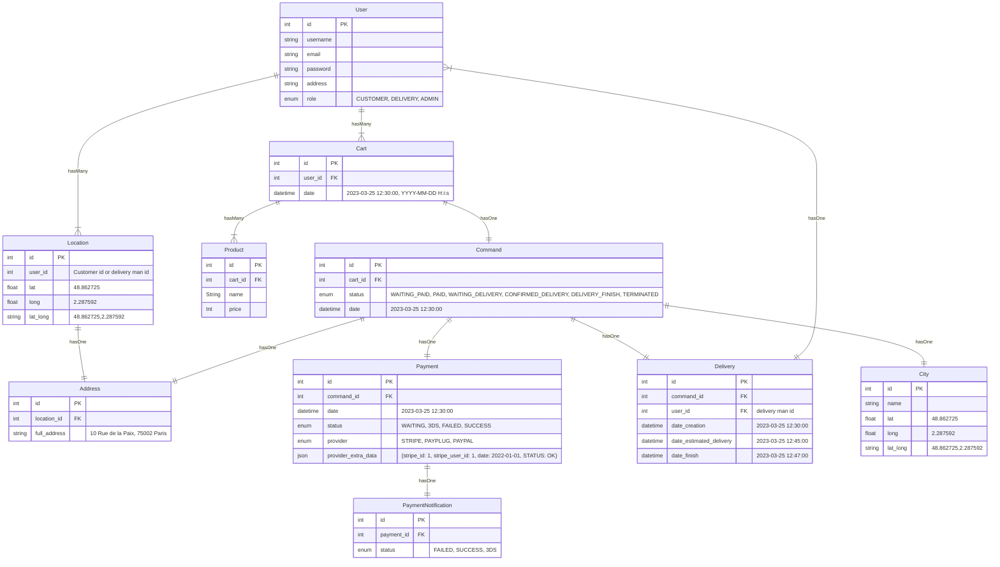
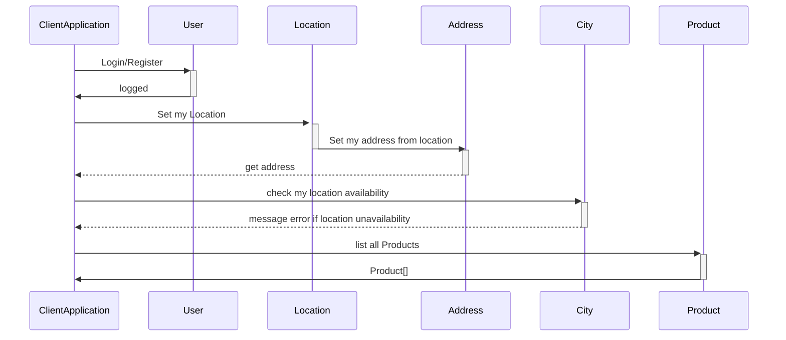
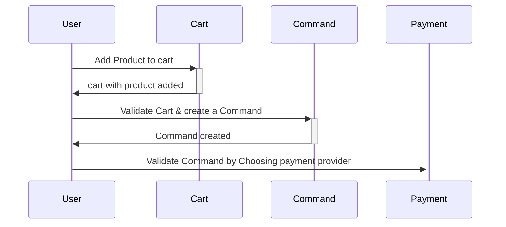
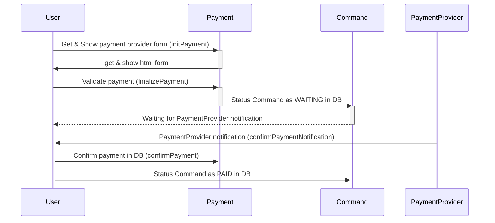
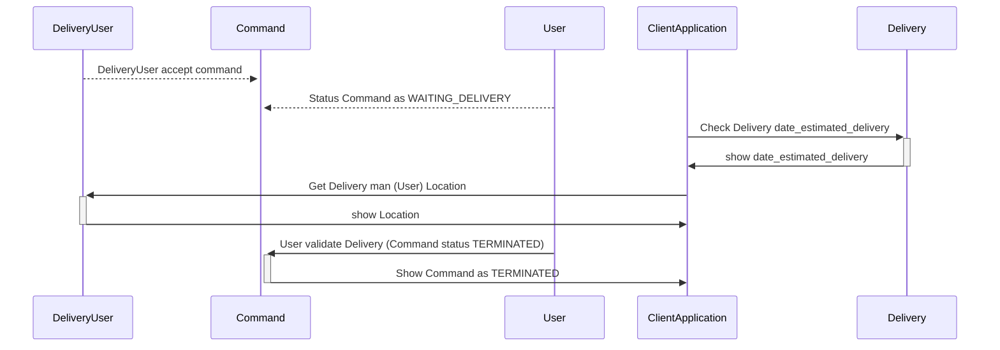
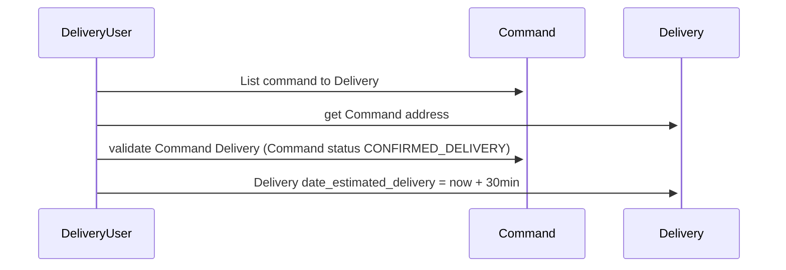
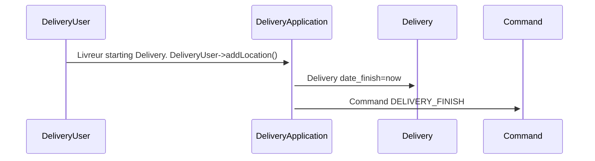

# Documentation Api-Allopico

# Stack

Wireframe: bubble, retool

Domain: http://jouss.in/

Auth: laravel

payment: payPlug

Api Rest: laravel

db: mysql

Hébergement: ma droplet digital ocean

App Android: flutter

api google map

api IGN : https://geoservices.ign.fr/documentation/services/api-et-services-ogc

# Documentation tools

https://stackedit.io/app#

https://mermaid.live/

https://app.diagrams.net/

https://kroki.io/examples.html

https://kroki.io/mermaid/svg/eNq1VV1vokAUfcZfccMzNoh17fJGBFtSvyK4mz6RiYztbPgwA3bbaP_7XoYvAWv7skQnw_XM3HPOvTNSbjLyzEnYA3w2CeVwOvX7pyPM4i1JWRyBDi8kmZPoXUCqsICdwPB9TpMkRy0j2tlnQnja2kMMIl5gVjz2D9s2rEacYBKHIYn8ZpocVfxSAFfkPaRR2gS2MCYN2Cvl71dBE5ZeB1xULoaSQ5PSIk7Zjp2b2lhUkSo8ER5WsBqXU8nIHcU0exgmYz6sHqtIknIWPUNEQtqTdkFMUgjwK9_e3dz90MbaSK7CMeJk7Ua7G49-ahguliLcy3-r1ig1KsvxUWVrdsY1XlnkgMo8DMuTQ5LGIcrEl5iDXzqALmNIrrf_bwoaAsRQVvUrEUGhNhMyfexJZ6bvDkHgkWIfeaDC-kBRHPLBVmBvCoxHqqrhnLPk3Mn66HyjspmJorqtOA0JC9rBPUmSvzH32_GCZBWm0SEEHgcUa7Nx3OXcWitgWjP7l7V-UsAw5_aiwzhv-eIEH3uSVHHOKifetniSS6Mkp25NAbARsOdsK94-WhfEMXf2zAep00el_eCTlKYMt80m2BGqNuyrw742goGmD1VdVRV4wqc_n_dNEx50pmMBGjmLI34t7bkYYViSkvSAlf5t2K69uPdWhm0qkI9lrDZxslxM7fXcMs9i5cyb2gvbeVDAtdZoteFaJvL7WlZTRDGWt1DdTJ8qylXnorKSwLdSSnBJvgJD01FgatgzCw1wNpOJ5Tg1fM_jV-Zjk8uOu7ZXVubU02q2uc8nxkxA_yR4kZRQj76lnHjIhYB8zHp3T5GsDgMFireiF0Qo46wDctb66gA_SMI13I2jw_Lxo9O-l27na-Xf5_iqnRsmgNzSLdwQ5ZG6N_3VLjuvycWmB7lzYUrFddk9Dd6W01zbJ8W8sIQmOMeJ71WJWotvR58u3rGIJS-dBeOyW6UeZH9q_wBP3UyH

# DATABASE

## Rest Resources / DB models :

**City** : Represent la liste des villes déservies.

**User** : User auth, profile

**Location** : Represent a gps location. Obtenu grâce au gps du tel. Le user possède une collection de Location.

**Address** : Represent a location address. Addresse complète en une chaine. Obtenu grâce à l'api G+ map à partir des
coordonnées. coords -> full address

**Product** : Represent un produit de l'application.

**Cart** : Represent an user list of selected products. temporaire, modififiable ... persisté dans le but d'améliorer l'
ux

**Command** : Represent a Cart validated before payment. Panier validé puis stocké en base en vue d'être réglé.

**Payment** : Represent a command payment.

**PaymentNotification** : Represent the Payment provider notification

**Delivery** : Represent Command Delivery

---

---

# Api REST

## api-allopico:

- host: 0.0.0.0:4444
- Domain: jouss.in

- Swagger: http://0.0.0.0:4444/api/docs/index.html
- Swagger: http://jouss.in/api/docs/index.html

- bdd:

    - dev: dev_api_allopico

#### **Api resource User** :

> POST /user/register()
> POST /user/login()
> GET/user/logout()

> GET /user/profile()
> PUT /user/profile()

#### **Crud sur les resources suivantes** :

> Resources:

- Product
- Cart
- Command
- Delivery

> GET /resource/list
> POST /resource/create
> GET /resource/show
> PUT /resource/update
> DELETE /resource/delete
> GET /resource/listFiltered

#### **Api Geo : Location - City - Address** :

api google map
api IGN : https://geoservices.ign.fr/documentation/services/api-et-services-ogc

CRUD:

> GET User Location collection
> POST add Location to User
> GET Location
> GET Location/all
> POST Location

> GET User Address collection
> POST add Address to User
> GET Address
> GET Address/all
> POST Address

> GET City
> GET City/all
> POST City

AUTRES ENDPOINTS:

> GET /GEO/lat_long_to_address()
> GET /GEO/lat_long_to_city()
> GET /GEO/address_to_city()
> GET /GEO/city_to_lat_long()
> GET /GEO/address_to_lat_long()
> GET /GEO/city_to_address()
> GET /GEO/address_full_to_address_object()
> GET /GEO/address_object_to_address_full()

#### **Api resources : Payment - PaymentNotification** :

> initPayment() - finalizePayment() - 3DS() - confirmPaymentNotification() (IPN) - confirmPayment()

---

# Application Flows

# Diagram Flows : User side

ClientApplication : public Customer application

User : Customer

### Flow Register/login, Gps location, list Products

### Flow Command and payment

### Flow payment

### Flow Delivery

# Diagram Flows : DeliveryUser side

DeliveryApplication : private livreur application

DeliveryUser : livreur

### Flow Command

### Flow Delivery

# Diagram Flows : Admin side

AdminApplication : private Admin application

AdminUser : Admin de l'app
